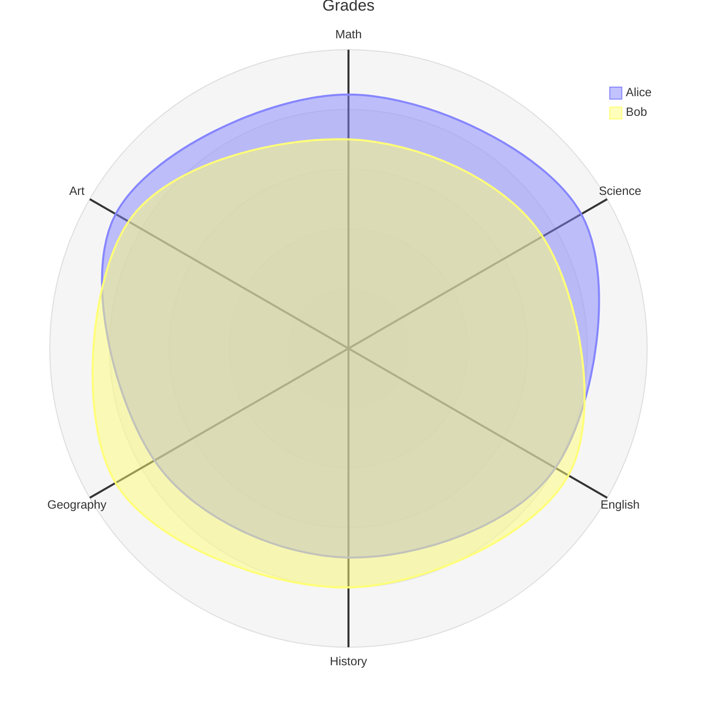

# Mermaid

mdlook also support the mermaid using the `mermiadjs`

define you code as `mermaid` on markdown
[ne](https://mermaid.js.org/syntax/flowchart.html)

---


```mermaid
---
title: "Grades"
---
radar-beta
  axis m["Math"], s["Science"], e["English"]
  axis h["History"], g["Geography"], a["Art"]
  curve a["Alice"]{85, 90, 80, 70, 75, 90}
  curve b["Bob"]{70, 75, 85, 80, 90, 85}

  max 100
  min 0
```

````text

```mermaid
---
title: "Grades"
---

radar-beta
axis m["Math"], s["Science"], e["English"]
axis h["History"], g["Geography"], a["Art"]
curve a["Alice"]{85, 90, 80, 70, 75, 90}
curve b["Bob"]{70, 75, 85, 80, 90, 85}

max 100
min 0
```
````
